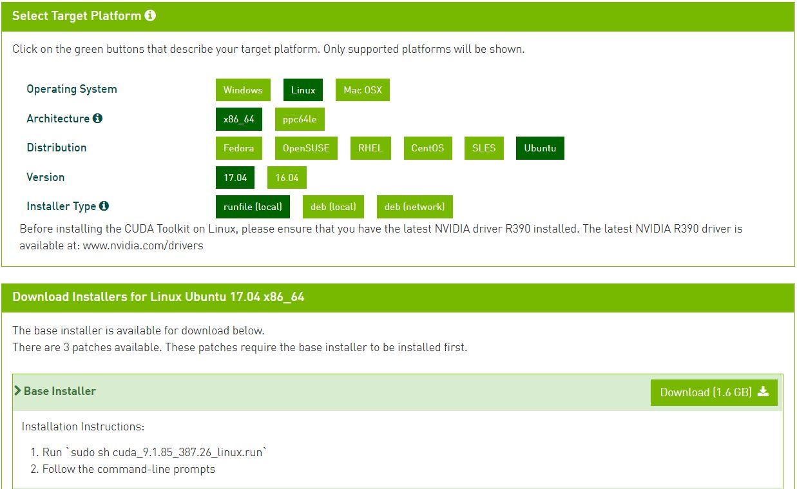

### Machine Learning

#### 机器学习环境搭建

1. 机器学习环境搭建需要有好的电脑配置：

* 硬件：CPU：i7，GPU ：GeForce GTX 960m， 8G内存，120G SSD+1T 机械硬盘。 
* 软件： ubuntu16.04+cuda8.0+cudnn v5+tensorflow 0.11

2. 系统环境

* 这里我安装的是Ubuntu 17.10.1。

* 镜像地址 https://www.ubuntu.com/download/alternative-downloads 

<p align="center">

</p>

* 安装完毕后Ubuntu 16.04的分辨率很低，在显卡驱动未安装之前，可以手动修改一下grub文件：
```bash
sudo vim /etc/default/grub
# The resolution used on graphical terminal
# note that you can use only modes which your graphic card supports via VBE
# you can see them in real GRUB with the command `vbeinfo'
#GRUB_GFXMODE=640x480
# 这里分辨率自行设置
GRUB_GFXMODE=1024x768
```
* 修改内核运行版本到最新
```bash
sudo update-grub
```
* 安装SSH Server，这样可以远程ssh访问这台GTX1080主机：
```bash
sudo apt-get install openssh-server
```
* 更新Ubuntu16.04源，可以选用的是[中科大的源](https://lug.ustc.edu.cn/wiki/mirrors/help/ubuntu):
```bash
cd /etc/apt/
sudo cp sources.list sources.list.bak
sudo vi sources.list
```
把下面的这些源添加到source.list文件头部：
```bash
deb http://mirrors.ustc.edu.cn/ubuntu/ xenial main restricted universe multiverse
deb http://mirrors.ustc.edu.cn/ubuntu/ xenial-security main restricted universe multiverse
deb http://mirrors.ustc.edu.cn/ubuntu/ xenial-updates main restricted universe multiverse
deb http://mirrors.ustc.edu.cn/ubuntu/ xenial-proposed main restricted universe multiverse
deb http://mirrors.ustc.edu.cn/ubuntu/ xenial-backports main restricted universe multiverse
deb-src http://mirrors.ustc.edu.cn/ubuntu/ xenial main restricted universe multiverse
deb-src http://mirrors.ustc.edu.cn/ubuntu/ xenial-security main restricted universe multiverse
deb-src http://mirrors.ustc.edu.cn/ubuntu/ xenial-updates main restricted universe multiverse
deb-src http://mirrors.ustc.edu.cn/ubuntu/ xenial-proposed main restricted universe multiverse
deb-src http://mirrors.ustc.edu.cn/ubuntu/ xenial-backports main restricted universe multiverse
```
* 更新系统软件
```bash
sudo apt-get update  #update是更新软件列表
sudo apt-get upgrade #upgrade是更新软件
```
3. 安装GTX1080驱动

```bash
sudo apt-get update
sudo apt-get install nvidia-367
sudo apt-get install mesa-common-dev
sudo apt-get install freeglut3-dev
```
在系统设置->软件更新->附加驱动->选择nvidia最新驱动(361)->应用更改.

4. 安装CUDA 8.0
CUDA Toolkit 9.1 Download: https://developer.nvidia.com/cuda-downloads

注意：
* 这个需要在NVIDIA的CUDA下载页面下，选择要使用的CUDA版本进行下载。 
* 选择自己系统对应的安装
* 下载需要注册。

<p align="center">

</p>
下载的“sh cuda_9.1.85_387.26_linux.run”有1.6G，按照Nivdia官方给出的方法安装CUDA8：

```bash
sudo sh cuda_8.0.27_linux.run --tmpdir=/opt/temp/
```
执行后会有一系列提示让你确认，关键的地方是是否安装361这个低版本的驱动:

```bash
Install NVIDIA Accelerated Graphics Driver for Linux-x86_64 361.62 
```
答案必须是N，否则之前安装的GTX1080驱动就白费了.

* 安装完毕后，再声明一下环境变量，并将其写入到 ~/.bashrc 的尾部:

```bash
export LD_LIBRARY_PATH="$LD_LIBRARY_PATH:/usr/local/cuda/lib64:/usr/local/cuda/extras/CUPTI/lib64"
```
5. 安装cuDNN 

cuDNN 下载:https://developer.nvidia.com/cudnn
* 下载需要填写一个调查问卷，就三个选项，建议认真填写。
* 填写完毕点击 I Agree To 前面的小方框。

```bash
tar xvzf cudnn-8.0-linux-x64-v5.1-ga.tgz
sudo cp cuda/include/cudnn.h /usr/local/cuda/include
sudo cp cuda/lib64/libcudnn* /usr/local/cuda/lib64
sudo chmod a+r /usr/local/cuda/include/cudnn.h /usr/local/cuda/lib64/libcudnn*
```
添加环境变量
```bash
export CUDA_HOME=/usr/local/cuda
```

6. 安装Tensorflow

Tensorflow 下载:https://github.com/tensorflow/tensorflow.

tensorflow github上面提到4种安装方式:
* Virtualenv installation 
* Anaconda installation 
* Docker installation 
* Installing from sources 

这里我选择Docker去安装:
```bash
docker run -it -p 3000:3000 gcr.io/tensorflow/tensorflow
```
7. 安装pip3

```bash
sudo apt-get install python3-pip
```
查看版本:
```bash
pip3 --version
```
8. 安装Bazel

```bash
echo "deb [arch=amd64] http://storage.googleapis.com/bazel-apt stable jdk1.8" | sudo tee /etc/apt/sources.list.d/bazel.list
curl https://bazel.build/bazel-release.pub.gpg | sudo apt-key add -
sudo apt-get update && sudo apt-get install bazel
```
9. 安装依赖库

```bash
# Python 2.7
sudo apt-get install python-numpy python-dev python-pip python-wheel
# Python 3.x
sudo apt-get install python3-numpy python3-dev python3-pip python3-wheel
```
10. 编译安装
下载Tensorflow: https://github.com/tensorflow/tensorflow
```bash
cd tensorflow
./configure
```
安装命令行提示，逐个设置编译选项（可以选择默认值）
* 编译CPU版：
```bash
bazel build --config=opt //tensorflow/tools/pip_package:build_pip_package
```
* 编译GPU版：
```bash
bazel build --config=opt --config=cuda //tensorflow/tools/pip_package:build_pip_package
```
注意，GCC 5需要设置--cxxopt="-D_GLIBCXX_USE_CXX11_ABI=0"选项。

bazel build会生成一个build_pip_package命令，用来生成python whl包:
```bash
# 编译生成python whl包
bazel-bin/tensorflow/tools/pip_package/build_pip_package /tmp/tensorflow_pkg
```
最后，安装生成的包
```bash
sudo pip install /tmp/tensorflow_pkg/tensorflow-1.2.0-py2-none-any.whl
```
11.最后验证安装
```python
$ python
>>> import tensorflow as tf
>>> hello = tf.constant('Hello, TensorFlow!')
>>> sess = tf.Session()
>>> print(sess.run(hello))
Hello, TensorFlow!
>>>
```
到这里机器学习环境已经安装成功了，接下来开始我们的机器学习之旅吧！
