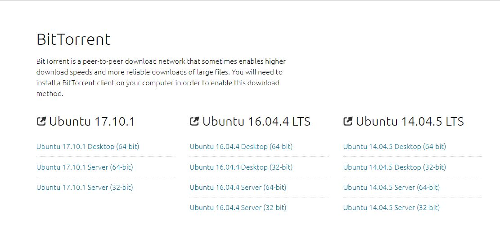

### Machine Learning

#### 机器学习环境搭建

1. 机器学习环境搭建需要有好的电脑配置：

* 硬件：CPU：i7，GPU ：GeForce GTX 960m， 8G内存，120G SSD+1T 机械硬盘。 
* 软件： ubuntu16.04+cuda8.0+cudnn v5+tensorflow 0.11

2. 系统环境
* 这里我安装的是Ubuntu 17.10.1。

* 镜像地址 https://www.ubuntu.com/download/alternative-downloads 

<p align="center">

</p>

* 安装完毕后Ubuntu 16.04的分辨率很低，在显卡驱动未安装之前，可以手动修改一下grub文件：
```bash
sudo vim /etc/default/grub
# The resolution used on graphical terminal
# note that you can use only modes which your graphic card supports via VBE
# you can see them in real GRUB with the command `vbeinfo'
#GRUB_GFXMODE=640x480
# 这里分辨率自行设置
GRUB_GFXMODE=1024x768
```
* 修改内核运行版本到最新
```bash
sudo update-grub
```
* 更新系统软件
```bash
sudo apt-get update  #update是更新软件列表
sudo apt-get upgrade #upgrade是更新软件
```

* 安装SSH Server，这样可以远程ssh访问这台GTX1080主机：
```bash
sudo apt-get install openssh-server
```

3.安装CUDA 8.0
CUDA Toolkit 9.1 Download: https://developer.nvidia.com/cuda-downloads

注意：
* 这个需要在NVIDIA的CUDA下载页面下，选择要使用的CUDA版本进行下载。 
* 选择自己系统对应的安装
* 下载需要注册。

<p align="center">

</p>