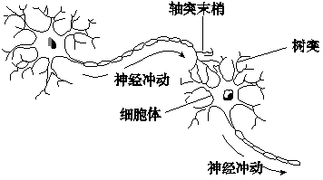
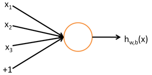

### Deeplearning : Introduction to Deep Neural Networks

#### 神经网络的定义

神经网络是一组大致模仿人类大脑构造设计的算法，用于识别模式。神经网络通过机器感知系统解释传感器数据，对原始输入进行标记或聚类。神经网络所能识别的模式是包含在向量中的数值形式，因此图像、声音、文本、时间序列等一切现实世界的数据必须转换为数值。

神经网络帮助我们进行聚类和分类。可以将其理解为建立在你所存储和管理的数据之上的一个聚类与分类层。对于未标记的数据，神经网络可以按照输入样例的相似之处将数据分组；若能用已标记的数据集训练，神经网络就可以对数据进行系统分类。（更准确地说，神经网络提取特征，再输入其他算法进行聚类和分类；因此可以将深度神经网络视为更大的机器学习应用系统的一部分，这个系统中还包括强化学习、分类和回归的算法.)

#### 应用实例

深度学习网络将输入映射至输出。它能发现关联。深度学习网络亦被称为“通用拟合器”，因为假设任意输入x与任意输出y之间存在一定关联或因果关系，神经网络就可以学习拟合x与y之间的函数关系f(x) = y。在学习过程中，神经网络会寻找最恰当的f，亦即将x转换为y的正确方式，无论是f(x) = 6x + 10还是f(x) = 10x - 2。

具体应用如下：

1.分类
一切分类任务都依赖于已标记的数据集；也就是说，人类必须将自己的知识转移到数据集中，以供神经网络学习标签与数据之间的关联。这被称为有监督学习。
* 检测人脸，识别图像中的人物，辨识面部表情（愤怒、快乐等）
* 识别图像中的物体（停车标志、行人、车道线等）
* 辨识视频中的手势动作
* 检测语音，识别讲话人，语音转换为文本，识别语音中的情感等
* 分辨垃圾信息（电子邮件）或欺诈信息（保险理赔申请）；辨识文本中的情感（客户反馈）
* 任何常人可以想到的标签、任何与数据相关联的重要结果都可以用来训练神经网络。

2.聚类
聚类或分组就是检测相似性。深度学习用于检测相似性时不需要标签。不依赖标签的学习又称无监督学习。世界上大部分的数据都是未标记数据。机器学习的法则之一是：用于训练算法的数据越多，算法就会变得越准确。因此，无监督学习具有产生高准确率模型的潜力。
* 搜索：比较文档、图像和声音，发现类似的项目。
* 异常检测：相似性检测的反面是异常事件和异常行为检测。在许多情况下，异常行为往往与欺诈等需要及时发现和预防的事件高度相关。

3.预测分析
深度学习可以通过分类来发现事物间的关联，比如图像像素与人物姓名之间的关联。这可以称为静态预测。同样，如果有足够且合适的数据，深度学习网络可以发现当前事件与未来事件之间的关联。从某种意义上说，未来事件就像是标签一样。深度学习其实并不在意时间，或者某件事是否已经发生。深度学习网络可以处理一个特定的时间序列，读取一串数字，然后预测接下来最有可能出现的是什么数字。
* 硬件故障预测（数据中心、制造业、运输业）
* 健康问题预测（根据人口统计信息和可穿戴设备的数据来预测中风、心脏病发作等）
* 顾客流失预测（根据网页活动及元数据来预测顾客流失的可能性）
* 员工流动预测（同上，但用于预测雇员流失）

如果预测水平越高，预防和提前行动的效果就越好。如上所述，神经网络正在让我们迈向一个意外更少的未来。意外并不会完全消失，只是一定程度地减少。

#### 神经网络的组成

在弄清楚这个问题前，我们先去了解下人的神经网络是怎么样的组成。

1.人的智能和神经元
人类智能最重要的部分是大脑，大脑虽然复杂，它的组成单元却是相对简单的，大脑皮层以及整个神经系统，是由神经元细胞组成的。而一个神经元细胞，由树突和轴突组成，它们分别代表输入和输出。连在细胞膜上的分叉结构叫树突，是输入，那根长长的“尾巴”叫轴突，是输出。神经元输出的有电信号和化学信号，最主要的是沿着轴突细胞膜表面传播的一个电脉冲。忽略掉各种细节，神经元，就是一个积累了足够的输入，就产生一次输出（兴奋）的相对简单的装置。

树突和轴突都有大量的分支，轴突的末端通常连接到其他细胞的树突上，连接点上是一个叫“突触”的结构。一个神经元的输出通过突触传递给成千上万个下游的神经元，神经元可以调整突触的结合强度，并且，有的突触是促进下游细胞的兴奋，有的是则是抑制。一个神经元有成千上万个上游神经元，积累它们的输入，产生输出。
人脑有1000亿个神经元，1000万亿个突触，它们组成人脑中庞大的神经网络，最终产生的结果即是人的智能。

#### 人工神经元和神经网络

一个神经元的结构相对来说是比较简单的，于是，科学家们就思考，我们的AI是否可以从中获得借鉴？神经元接受激励，输出一个响应的方式，同计算机中的输入输出非常类似，看起来简直就是量身定做的，刚好可以用一个函数来模拟。

#### 深度学习与神经网络
  深度学习是机器学习研究中的一个新的领域，其动机在于建立、模拟人脑进行分析学习的神经网络，它模仿人脑的机制来解释数据，例如图像，声音和文本。深度学习是无监督学习的一种。

 深度学习的概念源于人工神经网络的研究。含多隐层的多层感知器就是一种深度学习结构。深度学习通过组合低层特征形成更加抽象的高层表示属性类别或特征，以发现数据的分布式特征表示。

 Deep learning本身算是machine learning的一个分支，简单可以理解为neural network的发展。大约二三十年前，neural network曾经是ML领域特别火热的一个方向，但是后来确慢慢淡出了，原因包括以下几个方面：

(1)比较容易过拟合，参数比较难tune，而且需要不少trick；

(2)训练速度比较慢，在层次比较少（小于等于3）的情况下效果并不比其它方法更优；

所以中间有大约20多年的时间，神经网络被关注很少，这段时间基本上是SVM和boosting算法的天下。但是，一个痴心的老先生Hinton，他坚持了下来，并最终（和其它人一起Bengio、Yann.lecun等）提成了一个实际可行的deep learning框架。

Deep learning与传统的神经网络之间有相同的地方也有很多不同。

二者的相同在于deep learning采用了神经网络相似的分层结构，系统由包括输入层、隐层（多层）、输出层组成的多层网络，只有相邻层节点之间有连接，同一层以及跨层节点之间相互无连接，每一层可以看作是一个logistic regression模型；这种分层结构，是比较接近人类大脑的结构的。

#### 深度学习模型的训练方式

当有好几十个特征共同影响价格的时候，自然就会涉及权重分配的问题，例如有一些对房价是主要正权重的，例如地段、面积等，也有一些是负权重的，例如房龄等。

* 初始化权重计算
那么，第一个步其实是给这些特征加一个权重值，但是，最开始我们根本不知道这些权重值是多少？怎么办呢？不管那么多了，先给它们随机赋值吧。随机赋值，最终计算出来的估算房价肯定是不准确的，例如，它可能将价值100万的房子，计算成了10万。

* 损失函数
因为现在模型的估值和实际估值差距比较大，于是，我们需要引入一个评估“不准确”程度的衡量角色，也就是损失（loss）函数，它是衡量模型估算值和真实值差距的标准，损失函数越小，则模型的估算值和真实值的察觉越小，而我们的根本目的，就是降低这个损失函数。让刚刚的房子特征的模型估算值，逼近100万的估算结果。

* 模型调整
通过梯度下降和反向传播，计算出朝着降低损失函数的方向调整权重参数。举一个不恰当的比喻，我们给面积增加一些权重，然后给房子朝向减少一些权重（实际计算方式，并非针对单个个例特征的调整），然后损失函数就变小了。

* 循环迭代
调整了模型的权重之后，就可以又重新取一批新的样本数据，重复前面的步骤，经过几十万次甚至更多的训练次数，最终估算模型的估算值逼近了真实值结果，这个模型的则是我们要的“函数”。

#### 神经网络的要素

深度学习系统指一系列由多个层堆叠组成的特定神经网络。每一层则由节点构成。运算在节点中进行，节点的运作模式与人类的神经元大致相似，遇到足够的刺激信息时就会激活并释放信号。节点将输入数据与一组系数（或称权重）结合，通过放大或抑制输入来指定其在算法学习任务中的重要性。输入数据与权重的乘积之和将进入节点的激活函数，判定信号是否继续在网络中传递，以及传递的距离，从而决定信号如何影响网络的最终结果，例如分类动作。
单个节点的示意图:

节点层是一行类似神经元的开关，在输入数据通过网络时开启或关闭。从最初接收数据的第一个输入层开始，每一层的输出同时也是下一层的输入。

我们将输入特征与可调整的权重匹配，由此指定这些特征的重要性，即它们对网络的输入分类和聚类方式有多大程度的影响。

#### 深度神经网络
深度神经网络与常见的单一隐藏层神经网络的区别在于深度，即数据在模式识别的多步流程中所经过的节点层数。
传统机器学习系统主要使用由一个输入层和一个输出层组成的浅层网络，至多在两层之间添加一个隐藏层。三层以上（包括输入和输出层在内）的系统就可以称为“深度”学习。所以，深度是一个有严格定义的术语，表示一个以上的隐藏层。

在深度学习网络中，每一个节点层在前一层输出的基础上学习识别一组特定的特征。随着神经网络深度增加，节点所能识别的特征也就越来越复杂，因为每一层会整合并重组前一层的特征。

这被称为特征层次结构，复杂度与抽象度逐层递增。这种结构让深度学习网络能处理大规模高维度数据集，进行数十亿个参数的非线性函数运算。

最重要的是，深度学习网络可以发现未标记、非结构化数据中的潜在结构，而现实世界中的数据绝大多数都属于这一类型。非结构化数据的另一名称是原始媒体，即图片、文本、音视频文件等。因此，深度神经网络最擅长解决的一类问题就是对现实中各类未标记的原始媒体进行处理和聚类，在未经人工整理成关系数据库的数据中，甚至是尚未命名的数据中识别出相似点和异常情况。

例如，深度学习网络可以处理一百万张图片，根据其相似之处进行聚类：一个角落是猫的图片，一个角落是破冰船的图片，还有一个角落都是你祖母的照片。这就是所谓智能相册的基础。

同样的原理还可以应用于其他数据类型：深度学习可以对电子邮件或新闻报道等原始文本进行聚类。通篇都是愤怒投诉的邮件可以聚集到向量空间的一个角落，而客户的满意评价或者垃圾邮件则可以聚集到别的角落。这就是各类信息过滤器的基础，也可以用于客户关系管理（CRM）。这对于语音消息同样适用。 如果使用时间序列，数据可以按正常/健康行为或异常/危险行为进行聚类。由智能手机生成的时间序列数据可以用于洞悉用户的健康状况和生活习惯；而由汽车零部件产生的时间序列数据则可以用来预防严重故障。

与多数传统的机器学习算法不同，深度学习网络可以进行自动特征提取，而无需人类干预。由于特征提取是需要许多数据科学家团队多年时间才能完成的任务，深度学习可以用于缓解专家人数不足造成的瓶颈。较小的数据科学家团队原本难以实现规模化，而深度学习可以增强他们的力量。

用未标记数据训练时，深度神经网络的每一节点层会自动学习识别特征，方法是反复重构输入的样本，让网络猜测结果与输入数据自身几率分布之间的差异最小化。例如，受限玻尔兹曼机就以这种方式进行所谓的重构。

深度神经网络通过这一过程学习识别具体相关特征和理想结果之间的关联－它们在特征信号与特征所代表的含义之间建立联系，可以是完全重构，也可以利用已标记的数据。

深度学习网络用已标记数据训练后即可用于处理非结构化数据，所以这类网络所能适应的输入大大多于普通的机器学习网络。这对于提高性能大有帮助：网络训练所用的数据越多，网络的准确度就越高。（较差的算法经过大量数据训练后的表现可超过仅用很少数据训练的较好算法。）处理并学习大量未标记数据的能力是深度学习网络超越以往算法的独特优势。

深度学习网络最终有一个输出层：一个逻辑或softmax分类器，用于指定某一种特定结果或标签的可能性。我们称之为预测，但这是广义上的预测。比方说，对一个深度学习网络输入图像形式的原始数据，网络可能会判定输入数据代表一个人的可能性是90%。

